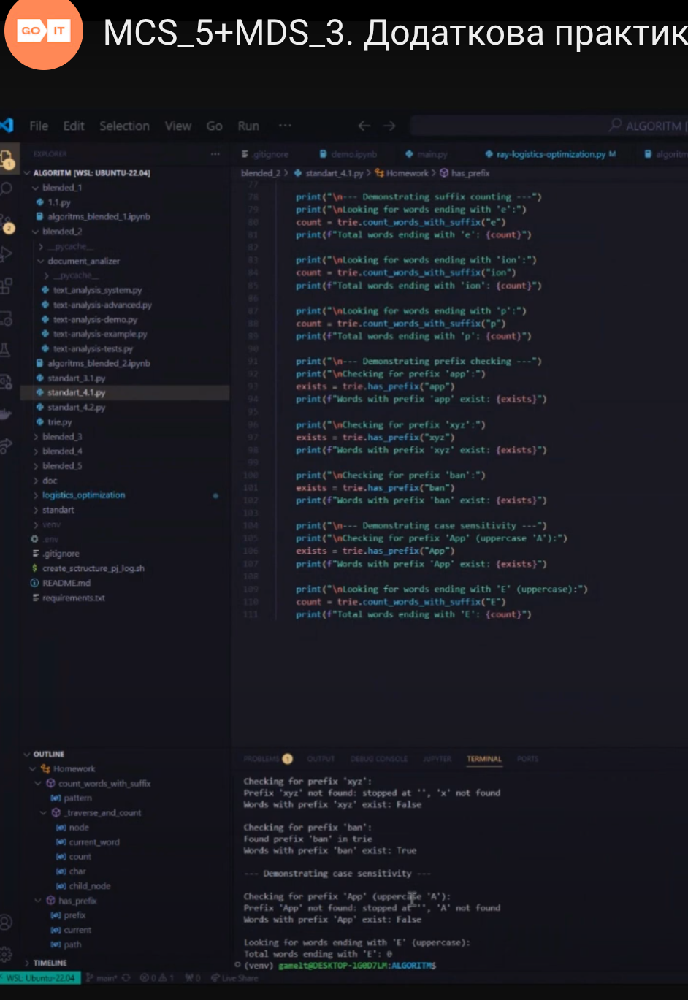

# goit-algo2-hw-04

## Task 1

### Description

One of possible solutions for this task is to use two tries:

- one for normal words
- one for reversed words

Also, we can use `self.keys()` and lookup suffixes with `endwith` method but it will be less efficient.

### Registy symbols

In task description we have this:

`Враховує регістр символів (10 б).` - if it means that we need to use `lower()` or `upper()` methods, then better way it update the trie `put` method to control case there and , aslo update `get`, `keys_with_prefix`, `keys_with_suffix` method to return value with the same case. 

We saw that `E` return no result, so thats mean , that we dont need to use `lower` or `upper` methods ?

